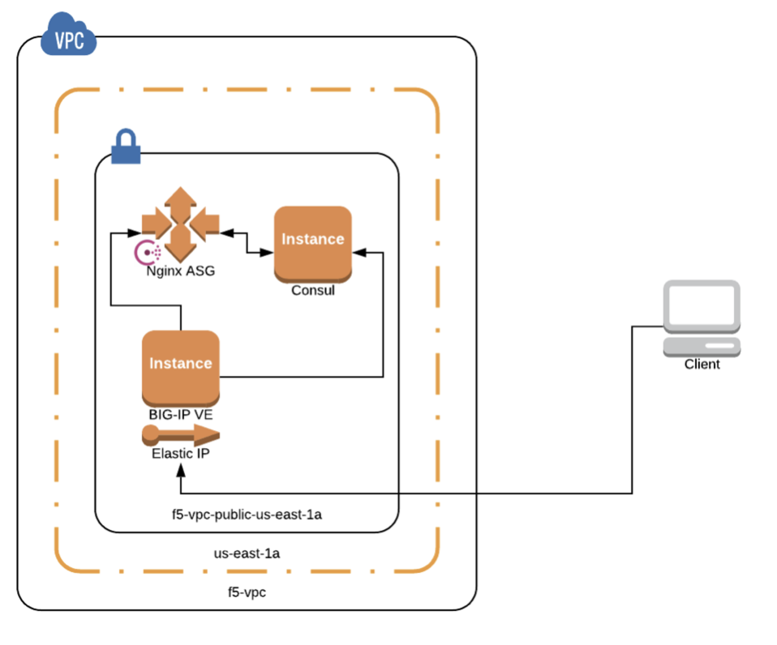

# F5 BIG-IP Terraform & Consul Webinar - Brownfield demo for existing deployments

This subfolder contains code to demonstrate a "brownfield" to approach to leverage Consul Service Discovery in conjuction with existing F5 BIG-IP deployments.

In many environments there may be already existing F5 BIG-IP deployments, which were not necessarily created completely by means of AS3.
Recreating those existing environments completey with AS3 definitions and migrating everything, like already existing virtual-servers etc., to AS3 might be a big hurdle for operations teams.

To also get the benefits of Consul - F5 BIG-IP integration in existing evironments, this subfolder contains demo code to show the migration steps for an existing F5 BIG-IP installation towards Consul - F5 BIG-IP integration for automating server pools, while keeping existing virtual-server etc. configuration as is.


# Architecture


# How to use this demo

## Provision Infrastructure

The `terraform` directory in the root folder of this repository has Terraform files for creating instances for Consul, F5 BIG-IP, IAM Policy, NGINX servers with Auto Scale Group.

- `main.tf` refers to what region is used on aws.
- `ssh.tf` is used to create the key pairs.
- `vpc.tf` is used to create a new vpc and also to define the aws security groups.
- `outputs.tf` is used to output and display F5 BIG-IP management IP and F5 BIG-IP dynamic Password


## Steps to simulate a brownfield approach with existing F5 BIG-IP deployments

## Setup core infrastructure

- Clone the repository & change working directory to terraform
```
git clone https://github.com/hashicorp/f5-terraform-consul-sd-webinar
cd f5-terraform-consul-sd-webinar/terraform/
```
- Create Terraform run
- Modify `terraform.tfvars.example` and add a prefix to identify your resources
- Rename `terraform.tfvars.example` to `terraform.tfvars`

```
terraform init
terraform plan
terraform apply
```

  - This will create BIG-IP, consul, NGINX instances on AWS
  - This will also seed a `terraform.tfvars` file in all necessary `brownflied` subfolders for use in the next step
  - It may take up to 5 minutes or after the run is complete for the environment to become ready. The URL for the BIG-IP UI is provided as part of the output.  Verify you can reach the UI before proceeding.


## Configure BIG-IP for brownfield demo

This step will configure the BIG-IP instance with a virtual-server and associated pools by means of Terraform to simulate an already existing brownfield environment.
In real life, it does not make a difference, if existing virtual-servers were created through Terraform, manually through the BIG-IP UI or by any other means.

- Check the Consul UI (URL provided as an output of the previous step) for the IP addresses of the available NGINX service endpoints.
- Change to subfolder `1-f5-brownfield-install-terraform`

```
cd brownfield-approach/1-f5-brownfield-install-terraform
```

- Adjust the IP addresses within the pool attachements to fit to the NGINX service endpoint IP addresses you discovered in the Consul UI within `brownfield-approach/1-f5-brownfield-install-terraform/main.tf`

```
resource "bigip_ltm_pool_attachment" "node1-attach" {
  pool = "${bigip_ltm_pool.webapp-pool.name}"
  node = "/Common/10.0.0.239:80"
}

resource "bigip_ltm_pool_attachment" "node2-attach" {
  pool = "${bigip_ltm_pool.webapp-pool.name}"
   node = "/Common/10.0.0.25:80"
}
```

- Run Terraform to deploy the initial F5 BIG-IP configuration

```
terraform init
terraform plan
terraform apply
```

- As an output you will see a URL you can use to access the backend application http://VIP_IP:8080 where VIP_IP is the Elastic IP which maps to BIG-IP Private VIP_IP.

## Scale NGINX AWS Auto Scaling Group

- Scale your NGINX Auto Scaling Group by either adjusting `nginx.tf` within the `terraform` folder or through the AWS Console
- Notice, that after some minutes additional NGINX service endpoints will appear within the Consul UI
- Also notice, that the F5 server pool will not automatically adjust to the new number of NGINX service endpoints

## Install AS3 extension and deploy dynamic backend pool with Consul integration

In this step you will download and load AS3 rpm into BIG-IP, for AS3 documentation and download please refer to https://github.com/F5Networks/f5-appsvcs-extension  note :- this currently uses AS3 3.17.1 rpm image
Also an additional F5 server pool will be deployed which is linked to Consul and automatically discovers NGINX instances registered with Consul. This pool is a "shared" pool and defined in `brownfield-approach/2-as3-shared-pool/nginx-pool.json`

- Change to subfolder `2-as3-shared-pool`

```
cd brownfield-approach/2-as3-shared-pool
```

- Run Terraform to deploy the AS3 extension as well as adding a dynamic server pool
```
terraform init
terraform plan
terraform apply
```

## Migrate to existing virtual-server to new backend pool

- Use F5 UI to verify, there is an additional backend server pool available now called `webapp-pool-consul` which has all NGINX service endpoints currently registered in Consul as members.
- Use F5 UI to adjust the configuration of the virtual-server called `webapp` to use pool `webapp-pool-consul` as its default pool.
- Scale up and down the NGINX Auto Scaling group again and verify, the pool `webapp-pool-consul` automatically adjutsts its members, based what on which instancres are registered within Consul.
- Congratulations! You have just migrated an existing F5 deployment to leverage Consul to automatically scale up and down the backend server pools!

# How to test?
- You can access backend applications using http://VIP_IP:8080 where VIP_IP is the Elastic IP which maps to BIG-IP Private VIP_IP.
- The NGINX servers are already in Auto Scale Group with consul agents running and sending all information to Consul server.
- Use case is when you destroy or bring down  one of the NGINX server, BIG-IP AS3 will poll the consul server and update the pool members automatically
- So as the NGINX servers are going up and down the BIG-IP Pool members are updated automatically without manual intervention.  
- Use http://consul_public_IP:8500 to access the consul server and check the status of consul nodes count
